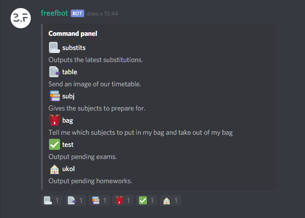

# Marvin


Marvin is a simple discord bot made for personal purposes in python using [discord.py](https://github.com/Rapptz/discord.py). This bot is focused on class discord servers for students, however can be easily modified for your own purposes.

*Note: Marvin is still called freefbot in some places. This is because the bot was renamed.*

## Setup
There is no public server hosting this bot, therefore you need to run it yourself on your RPi or something. Follow the instructions below.

 - Register your discord bot and get a API token at https://discordapp.com/developers/applications/
 - Install **Python 3.7** and `pipenv` if you haven't already.
 - Clone the project.
```bash
git clone https://github.com/JakubBlaha/Marvin.git
```
 - Create the [`config.yaml`](#the-local-config) file with your API key and the [`config`](#the-remote-config) channel in your discord server as shown below. 
 - Setup the virtual environment.
 ```bash
 cd Marvin
 pipenv install
 ```
 - Activate the virtual environment and run the bot.
 ```bash
 pipenv shell
 python3.7 client.py
 ```

Now go ahead and enjoy the super-feature-rich discord bot. 😁


## Features
**Available commands:**

Command|Action
-------|------
`!eval`|Evaluate a python expression.
`!random`|Give a random number.
`!repeat`|Repeat the given message.
`!table`|Send the timetable.
`!subj`|Output the subjects to prepare for.
`!bag`|Output which subjects to take out and put in your bag.
`!substits`|Output the coming substitutions.
`!exam`|Output exams from the `exam_channel_id` channel.
`!hw`|Output homeworks from the `homework_channel_id` channel.
`!del`|Delete a number of messages.
`!embed`|Build/edit an embed.
more ..| 🎆 🌟 🎇 ⭐ ✨

## Usage
### The local config
There needs to be a `config.yaml` file in the root folder with some critical information.
```yaml
token: ...  # The discord app API token
guild_id: ...  # The id of your guild

# Logging
loglevel: 30  # warning (default)
modulelog: False  # When set to true will enable logs from some external modules disabled by default

# Remote config
remote_config_channel_name: config  # The name of the channel to load the remote config from. This is `config` by default.
load_dev_config: False  # Whether messages starting with `dev` in the config channel should be loaded.

# Other
command_prefix: "!"
headless_chrome: True  # Whether to run chrome in the headless mode when using selenium.
```

### The remote config
The remote config feature allows to add the bot configuration in a separate discord channel named `config` in the *yaml* format. The last 100 messages will be considered.

> The entry `moodle_password` needs to be encrypted in order to keep it public and secure. The encryption key will be the token of the discord application. Use the `!encrypt` command to get the encrypted version of your password and place it to the correct entry in the  remote config. Use this command **only in the DM channel** to prevent anyone from stealing your credentials.

```yaml
# General
locale: en-us  # The locale that will be used for various purposes
presences: [['!help', idle]]  # A list of presence the bot will cycle through. One for 10 seconds. The format is [name, Status[online, idle, invisible, dnd]].

# The Command Panel
command_panel_channel_id: ...

# The auto Reactor
auto_reactor_channel_ids: [...]
auto_reactor_reaction_ids: [...]

# COMMANDS
# !table
timetable_url: https://www.example.com
#!subj, !bag
timetable:
# Days
 -  # Monday - Subjects
# - [Short, Long name, HM - 0905 for 9:55 - 24h format]
  - [M, Maths, 0800]
  - [P, Physics, 0900]
 -  # Tuesday
  - ...
  - ...

# The !substits command
substits_col_indexes: [...]       # Considered columns
substits_headers: [...]           # Custom table headers
substits_replace_contents: {...}  # Pairs of original -> replaced keywords in the table
moodle_username: ...  # The username to your moodle account
moodle_password: ...  # The password to your moodle account encrypted with the !encrypt command
substits_kwargs:
 login_url: ...  # The url to the moodle login form
 course_url: ...  # The url to the substits course
 link_regex: .*\.pdf  # The regex used to get the latest pdf link

# Cleverbot/chatbot
chatbot_memory_seconds: 120  # How long should be the bot able to respond to messages it is not tagged in after the last valid message
```

### The embed builder
The bot contains an embed builder which can build new and edit existing embeds in a user-friendly way. Only few commands and message reactions are used in the process.

**Commands**
  - `new` - The bot will kindly ask for the required information and build an embed based on the information provided.
  - `edit` - A group of subcommands used to edit an existing embed. The syntax of the subcommand is `!embed edit [embed index] [subcommand] [value]`. An embed index has to be passed right before any of the subcommand. The index is counted from *0* and includes only the embeds, but no messages containing no embeds. `title`, `url`, `description`, `color`, `footer` and `fields` subcommands are available.
  
    All of the subcommands require an actual value to be passed after the subcommand as already stated, *except* the `fields` subcommand, which will guide you through the process.

    The following actions are available during the field editing.

    Reaction | Action
    ---------|-------
    ➕ | Add field
    ✏ | Edit field
    ➖ | Remove field
    ↩ | Undo
    ↪ | Redo
    ✅ | Save


**Examples**
> Editing the title of the *most recent* embed title to `My awesome title`.
```
!embed edit 0 title My awesome title
```
> Editing the embed fields of the *second most recent* embed.
```
!embed edit 1 fields
```
We can also use aliases for the subcommands. For example `t` will become `title`, `d` `description`, etc. Note that the alias for the `footer` subcommand is `foo` and not `f`, since that one is for `fields`. A full list of aliases can be retrieved by either of these commands.
```
!help embed edit
!embed edit
```


>Setting an embed title was never easier


>At least creating the embed is fun!

### The Embed Manager
At the moment, the bot can add ❌ reactions to seemingly outdated embeds in channels with the 🔔 emoji in their topic and list the upcoming events in the `#general`channel topic. We will implement more features soon!


>Pretty late to remove the embed actually. ☺


>I would forget, if my bot haven't told me.

### The Cleverbot integration
This feature is just for fun, anything else. Simply tag the bot in your message and tell him something dumb. The remote config allows to set how long the bot should act like it was tagged in a message even it he was not. This will be reset with every message. The default is `120` seconds. The command `!shut up` can be used in order to suspend the conversation with the bot immediately.
```yaml
chatbot_memory_seconds: 120
```


>Pretty need, heh?

### The Command panel
The Command panel is a feature, which provides the ability to execute commands more easily. That is done clicking the reaction. All the messages generated in this channel will be deleted after one minute.


>Access your timetable more easily

*The Command panel is a channel-specific feature, so use it in a dedicated channel only.*

### The `!substits` command
The table scraper is a sort of a personal feature, but can be easily modified if needed. The scraper downloads a pdf file from moodle, extracts a table from it and sends the data as a set of constructed images. All of the configuration but the *username* and *password*, which are stored in the *local config*, are stored in the *remote config*.


>Never have to go through the long process of downloading the pdf again. Have it nice and easy here!

### The Twitch Client
The twitch client watches for messages with emote names in them and replaces them with their actual images using discord embeds. If the emoji names is the only content of the message, the message will be deleted.


>What would be the point of our gamer lifes without them?

### The console-like behavior
The bot does execute commands as you would expect, but in addition to that, messages, that are edited and contain commands, invoke the commands either. This behavior is useful in situations when the user miss-types a command. The bot also offers the `!re` command, which re-executes the last command respectively to the user who uses it. The new command output overwrites the output before for some commands.